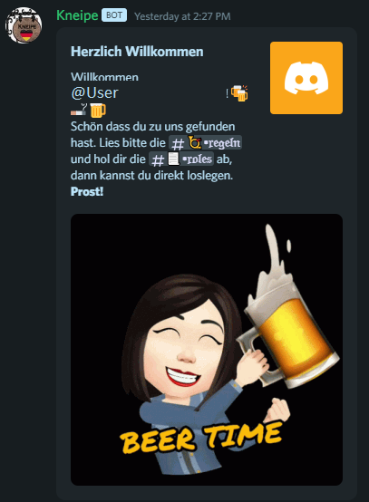
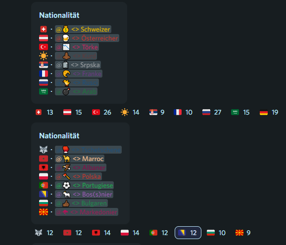

<h1>Kneipe Bot</h1>

This is a discord bot developed for the "Kneipe" Server. It's programmed with the discord.py library and uses the **giphy** API.

It contains following functions: 

- Welcome message with random generated beer gif (this server's theme is a pub)

- Get and abandon roles by reacting to certain reactions

- User who join through a specific invite link get assigned a special role
- The &purge [amount] command deletes messages, by default all messages but you can also purge an amount of messages

** ~ developed by Sanel Trnka**
